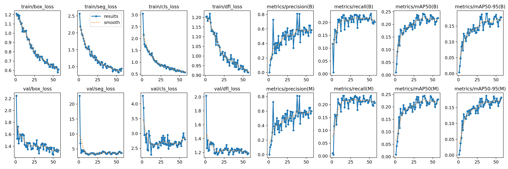
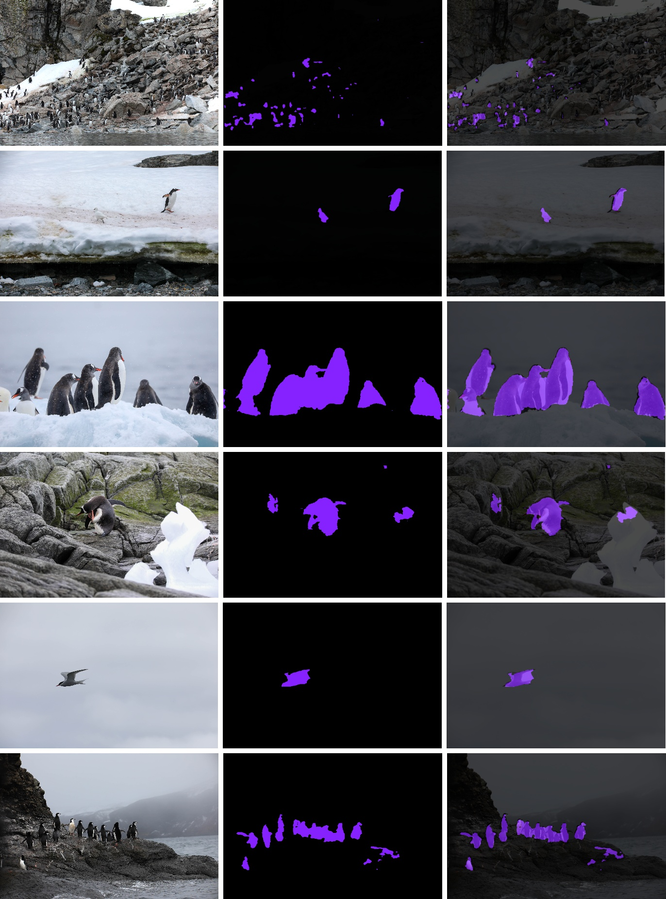

# 南极动物语义分割项目

本项目基于 **YOLOv8-seg** 模型，实现了对南极动物（企鹅、海鸥、海豹）的高精度语义分割。项目采用 **Roboflow** 进行精细化人工标注，并结合 **迁移学习 (Transfer Learning)** 策略，在 NVIDIA RTX 4060 (8GB) 环境下完成了从数据处理、模型训练到推理评估的全流程。

---

## 🎯 项目特点

- ✅ **高精度标注**: 使用 Roboflow Polygon Tool 进行像素级人工标注，确保 Ground Truth 质量。
- ✅ **实时分割**: 采用 YOLOv8n-seg 轻量级模型，推理速度快，适配 8GB 显存环境。
- ✅ **迁移学习**: 基于 COCO 预训练权重进行微调，有效应对小样本问题。
- ✅ **完整工作流**: 包含数据格式转换、模型训练、性能评估及结果可视化的完整脚本支持。
- ✅ **详细评估**: 提供 Precision, Recall, mAP50, mAP50-95 等多维度评价指标。

---

## 🛠️ 环境配置

### 系统要求
- Python 3.8+
- CUDA 11.8+ (推荐用于 GPU 训练)
- 8GB+ GPU 显存 (推荐 RTX 3060/4060 或更高)

### 安装依赖

推荐使用 Conda 创建虚拟环境：

```powershell
# 1. 创建环境
conda create -n hw1 python=3.9 -y

# 2. 激活环境
conda activate hw1

# 3. 安装 PyTorch (请根据你的 CUDA 版本调整)
conda install pytorch torchvision torchaudio pytorch-cuda=11.8 -c pytorch -c nvidia

# 4. 安装其他依赖
pip install -r requirements.txt
```

---

## 📁 项目结构

```
hw1-semantic-segmentation-Startshark/
├── dataset/                    # 原始数据集目录  
├── Polar Animal.v9/            # 从 Roboflow 导出的 COCO 格式数据
├── data/
│   └── processed/              # 转换后的 YOLO 格式数据
│       ├── train/
│       ├── val/
│       └── antarctic.yaml      # YOLO 数据集配置文件
├── runs/                       # 实验结果输出目录
│   └── segment/
│       └── antarctic_yolo_v9/  # 本次实验的主要结果
│           ├── weights/        # 训练好的模型权重 (best.pt)
│           ├── results.png     # 训练曲线图
│           └── appendix_results/ # 拼接后的测试集结果图
├── scripts/                    # 功能脚本
│   ├── convert.py              # 数据格式转换 (COCO -> YOLO)
│   ├── train.py                # 模型训练脚本
│   ├── test.py                 # 模型推理与测试脚本
│   ├── stitch.py               # 结果拼接可视化脚本
│   └── evaluate.py             # 评估脚本
├── report.tex                  # 实验报告 LaTeX 源码
├── requirements.txt            # 项目依赖列表
└── yolov8n-seg.pt              # YOLOv8 预训练权重
```

---

## 🚀 快速开始

### 1. 数据准备

首先，确保你已经下载了数据集并放置在 `dataset/` 目录下。然后运行转换脚本，将 COCO JSON 格式转换为 YOLO TXT 格式：

```powershell
python scripts/convert.py
```
该命令会自动生成 `data/processed/` 目录和 `antarctic.yaml` 配置文件。

### 2. 模型训练

使用 `train.py` 开始训练模型。你可以根据显存大小调整 `batch-size`：

```powershell
python scripts/train.py --epochs 100 --batch-size 8 --img-size 640
```
训练结果（权重、日志、图表）将保存在 `runs/segment/antarctic_yolo_v9/`。

### 3. 模型测试与评估

使用训练好的最佳权重 (`best.pt`) 对测试集进行推理：

```powershell
python scripts/test.py --model runs/segment/antarctic_yolo_v9/weights/best.pt --source data/processed/test/images
```

### 4. 生成附录可视化图

为了直观展示分割效果，可以使用 `stitch.py` 生成原图、掩码和预测结果的对比拼接图：

```powershell
python scripts/stitch.py
```
生成的图片将保存在 `runs/segment/antarctic_yolo_v9/appendix_results/stitched_appendix.jpg`。

---

## 📊 实验结果

### 训练曲线
模型在 57 轮左右触发早停，各项损失函数收敛良好，mAP 指标稳步提升。



### 分割效果展示
下图展示了测试集上的部分分割结果（左：原图，中：Ground Truth，右：预测结果）：



---

## 📝 改进方向

虽然模型在主要类别（企鹅）上表现良好，但仍有改进空间：
1.  **数据增强**: 针对海豹、海鸥等小样本类别引入 Mosaic 或 Copy-Paste 增强。
2.  **注意力机制**: 引入 CBAM 等模块以区分企鹅与相似的岩石背景。
3.  **弱监督/无监督学习**: 探索利用无标注数据进行预训练，降低标注成本。

---

## 🔗 参考资料

- [Ultralytics YOLOv8 Docs](https://docs.ultralytics.com/)
- [Roboflow](https://roboflow.com/)
- [COCO Dataset](https://cocodataset.org/)
